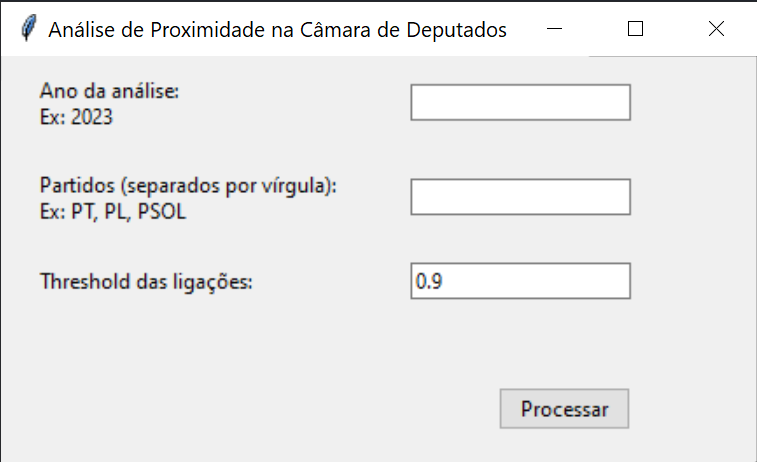
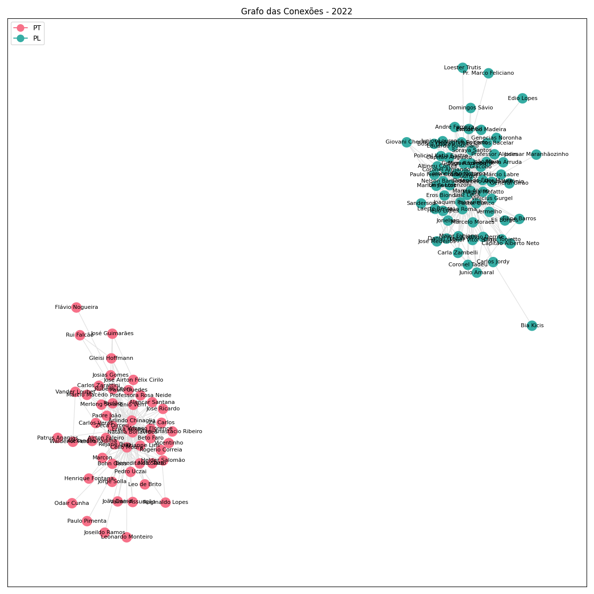

# Análise de Proximidade na Câmara de Deputados

 

## Descrição:
Este projeto analisa as relações de proximidade entre deputados na Câmara dos Deputados do Brasil onde, através de uma interface gráfica, o usuário pode definir parâmetros específicos para a sua análise.

O programa gera três tipos principais de visualizações:

1. Centralidade de Betweenness: Mostra a importância dos deputados como "pontes" na rede.
2. Heatmap: Representa a correlação entre os deputados com base em suas concordâncias.
3. Grafo de Conexões: Visualiza as conexões entre deputados.

## Dependências:
    - pandas: Para manipulação e análise de dados.
    - numpy: Suporte para arrays e funções matemáticas.
    - networkx: Para criação, manipulação e estudo da estrutura de redes complexas.
    - matplotlib: Para criação de visualizações/gráficos.
    - seaborn: Para melhoria na visualização de gráficos e plots estatísticos.
    - tkinter: Para a interface gráfica do usuário.

## Comando para Instalação das Dependências:
    pip install pandas numpy networkx matplotlib seaborn

## Autores:
    Henrique Barcelos Saraiva - 19.2.8007
    Israel Matias do Amaral - 18.1.8050